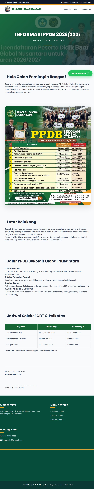
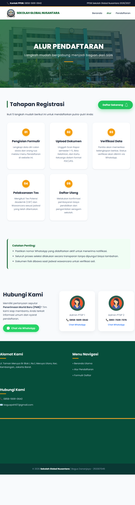
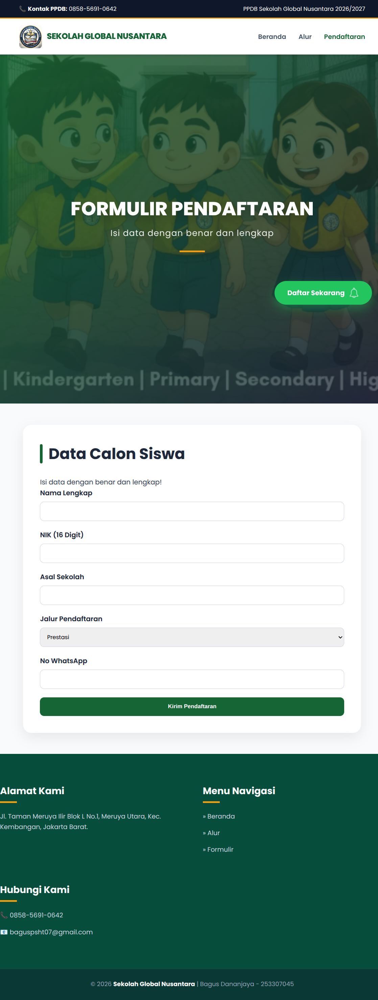

# 🎓 Website PPDB Sekolah Global Nusantara 2026/2027

Website ini merupakan sistem informasi **Penerimaan Peserta Didik Baru (PPDB)** berbasis web yang dirancang untuk memberikan informasi dan layanan pendaftaran secara online dengan tampilan modern, interaktif, dan responsif.

---

## 🌐 Preview Website




---

1. **Halaman Beranda (index.html)**


2. **Halaman Alur (alur.html)**


3. **Halaman Form (form.html)**


---

## ✨ Fitur Utama

### 🏠 Halaman Beranda

* Informasi lengkap PPDB
* Latar belakang sekolah
* Jalur pendaftaran
* Jadwal seleksi

### 📊 Halaman Alur

* Step-by-step pendaftaran
* Tampilan card modern
* Kontak admin WhatsApp

### 📝 Form Pendaftaran

* Input data calon siswa
* Validasi NIK (16 digit angka)
* Notifikasi sukses & error
* Reset form otomatis

### 📱 Responsive Design

* Bisa dibuka di HP & laptop

---

## 🛠️ Teknologi yang Digunakan

* HTML5
* CSS3
* JavaScript
* Google Fonts (Poppins)

---

## 📁 Struktur Folder

```
project/
│
├── index.html
├── alur.html
├── form.html
│
├── asset/
│   ├── css/
│   │   └── style.css
│   ├── img/
│   │   ├── logo.jpeg
│   │   ├── banner.png
│   │   ├── img1.png
│   │   ├── sekolahan.png
│   │   ├── kartun.png
│   │   ├── screenshot-beranda.png
│   │   ├── screenshot-alur.png
│   │   └── screenshot-form.png
```

---

## ⚙️ Cara Menjalankan

1. Download / clone project
2. Buka folder project
3. Jalankan:

   ```
   index.html
   ```
4. Buka di browser

---

## 🧠 Penjelasan Kode

### 🔹 HTML

Struktur terdiri dari:

* Topbar
* Navbar
* Hero section
* Content
* Footer

---

### 🔹 CSS

Menggunakan:

* Flexbox & Grid
* Warna utama:

  * Hijau (#166534)
  * Orange (#f59e0b)
* Responsive design

---

### 🔹 JavaScript

Digunakan untuk validasi form dan notifikasi:

```javascript
const form = document.getElementById("formPPDB");
const notif = document.getElementById("notif");

function showNotif(message, type){
    notif.innerText = message;
    notif.className = "notif show " + type;

    setTimeout(() => {
        notif.classList.remove("show");
    }, 3000);
}

form.addEventListener("submit", function(e){
    e.preventDefault();

    const nik = document.getElementById("nik").value.trim();

    if(nik.length !== 16 || isNaN(nik)){
        showNotif("NIK harus 16 digit angka!", "error");
        return;
    }

    showNotif("Pendaftaran berhasil dikirim!", "success");

    form.reset();
});
```

---

## 👨‍💻 Author

**Bagus Dananjaya**
- NIM: 253307045
- Kelas:2B
- Prodi: D3 Teknologi Informasi


---

## ⭐ Kesimpulan

Website ini memiliki:

* Tampilan modern
* Struktur rapi
* Validasi form berjalan
* Responsive di berbagai perangkat

---
